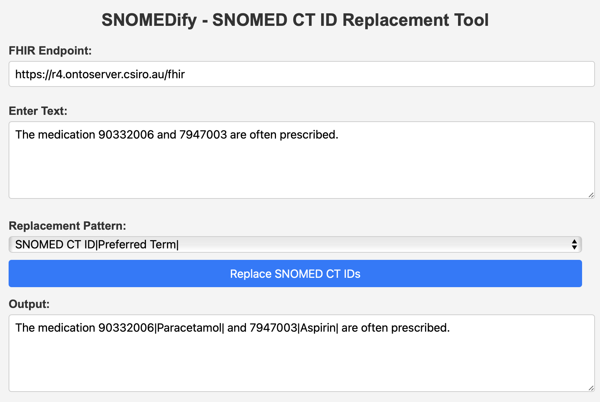

# SnoText - SNOMED CT ID Replacement Tool

SnoText is a web tool that replaces SNOMED CT IDs within a text block with the preferred terms from the SNOMED CT terminology. Using the [FHIR API from Ontoserver](https://r4.ontoserver.csiro.au/fhir), the tool retrieves the preferred term associated with each SNOMED CT ID and inserts it into the text. The user can select between two replacement patterns.



## Features

- Replaces SNOMED CT IDs in a text block with their preferred terms.
- Allows the user to choose between two formatting styles:
  - **Pipe format**: `12345|Preferred Term|`
  - **Underscore format**: `12345_Preferred_Term`
- Displays any error messages in a convenient notification bar.

## Usage

1. **Enter Text**: Paste or type text containing SNOMED CT IDs (5 or more digits).
2. **Select Replacement Pattern**: Choose your preferred format:
   - Pipe format: appends the preferred term after the SNOMED CT ID with `|Preferred Term|`.
   - Underscore format: appends the preferred term after the SNOMED CT ID, replacing spaces with underscores, e.g., `12345_Preferred_Term`.
3. **Replace SNOMED CT IDs**: Click on the "Replace SNOMED CT IDs" button. The tool will fetch preferred terms and update the text accordingly.
4. **View Output**: The output field will display the modified text with preferred terms inserted.

## Example

**Input Text:** 
The medication 123456 and 234567 are often prescribed.

**Output Text (Pipe Format):**
The medication 123456|Paracetamol| and 234567|Aspirin| are often prescribed.

**Output Text (Underscore Format):**
The medication 123456_Paracetamol and 234567_Aspirin are often prescribed.

## Installation & Setup

This tool is hosted on GitHub Pages, and you can access it directly without installation.

Visit the live version: [https://dionmcm.github.io/SnoText](https://dionmcm.github.io/SnoText)

If you'd like to run the tool locally:
1. Clone the repository:
   ```bash
   git clone https://github.com/dionmcm/SnoText.git